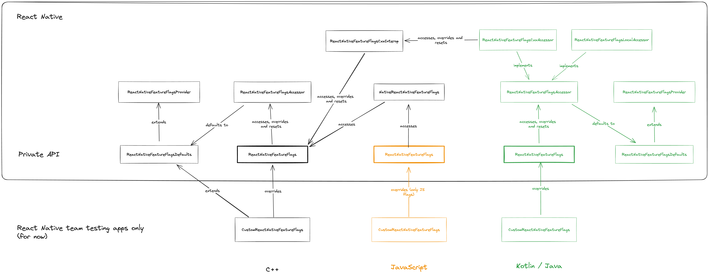

# Feature Flags

Feature flags are values that determine the behavior of specific parts of React
Native. This directory contains the configuration for those values, and scripts
to generate files for different languages to access and customize them.

There are 2 types of feature flags:
* Common: can be accessed from any language and they provide consistent values
everywhere.
* JS-only: they can only be accessed and customized from JavaScript.

## Definition

The source of truth for the definition of the flags is the file `ReactNativeFeatureFlags.json`
in this directory. That JSON file should have the following structure:

```flow
type Config = {
  common: FeatureFlagsList,
  jsOnly: FeatureFlagsList,
};

type FeatureFlagsList = {
  [flagName: string]: {
    description: string,
    defaultValue: boolean | number | string,
  },
};
```

Example:
```json
{
  "common": {
    "enableMicrotasks": {
      "description": "Enable the use of microtasks in the JS runtime.",
      "defaultValue": false
    }
  },
  "jsOnly": {
    "enableAccessToHostTreeInFabric": {
      "description": "Enables access to the host tree in Fabric using DOM-compatible APIs.",
      "defaultValue": false
    }
  }
}
```

After any changes to this definitions, the code that provides access to them
must be regenerated running `yarn featureflags-update` from the `react-native`
repository.

## Access

### C++ / Objective-C

```c++
#include <react/featureflags/ReactNativeFeatureFlags.h>

if (ReactNativeFeatureFlags::enableMicrotasks()) {
  // do something
}
```

### Kotlin

```kotlin
import com.facebook.react.internal.featureflags.ReactNativeFeatureFlags

fun someMethod() {
  if (ReactNativeFeatureFlags.enableMicrotasks()) {
    // do something
  }
}
```

### JavaScript

```javascript
import * as ReactNativeFeatureFlags from 'react-native/src/private/featureflags/ReactNativeFeatureFlags';

if (ReactNativeFeatureFlags.enableMicrotasks()) {
  // Native flag
}

if (ReactNativeFeatureFlags.enableAccessToHostTreeInFabric()) {
  // JS-only flag
}
```

## Customization

### C++/Objective-C

```c++
#include <react/featureflags/ReactNativeFeatureFlags.h>
#include <react/featureflags/ReactNativeFeatureFlagsDefaults.h>

class CustomReactNativeFeatureFlags : public ReactNativeFeatureFlagsDefaults {
 public:
  CustomReactNativeFeatureFlags();

  bool enableMicrotasks() override {
    return true;
  }
}

ReactNativeFeatureFlags::override(std::make_unique<CustomReactNativeFeatureFlags>());
```

### Kotlin

```kotlin
import com.facebook.react.internal.featureflags.ReactNativeFeatureFlags
import com.facebook.react.internal.featureflags.ReactNativeFeatureFlagsDefaults

fun overrideFeatureFlags() {
  ReactNativeFeatureFlags.override(object : ReactNativeFeatureFlagsDefaults() {
    override fun useMicrotasks(): Boolean = true
  })
}
```

### JavaScript

```javascript
import * as ReactNativeFeatureFlags from 'react-native/src/private/featureflags/ReactNativeFeatureFlags';

ReactNativeFeatureFlags.override({
  enableAccessToHostTreeInFabric: () => true,
});
```

## Architecture

The architecture of this feature flags system can be described as follows:
* A shared C++ core, where we provide access to the flags and allow
customizations.
* A Kotlin/Java interface that allows accessing and customizing the values in
the C++ core (via JNI).
* A JavaScript interface that allows accessing the common values (via a native
module) and accessing and customizing the JS-only values.



_This image has an embedded [Excalidraw](https://www.excalidraw.com) diagram,
so you can upload it there if you need to make further modifications._
